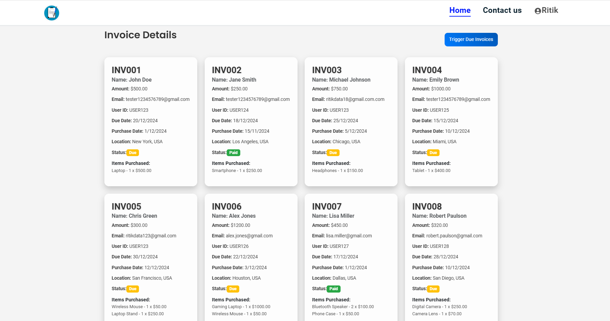
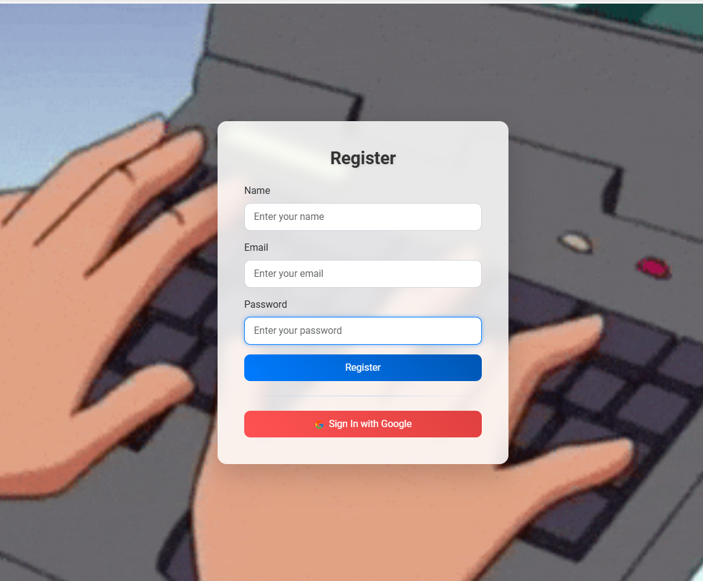
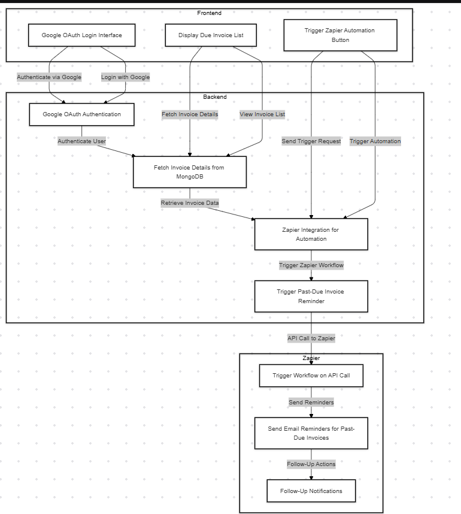

# Invoice Management System

## Overview
This project is a full-stack application that helps users manage their invoices efficiently. It features a **Node.js backend ** and a **React frontend**. Users can log in with Google OAuth, view details of their due invoices, and trigger automation workflows for handling past-due invoices using Zapier.

---

## Features

### Backend (Node.js Microservice):
1. **User Authentication:**
   - Users can log in securely using Google OAuth.
2. **Invoice Details:**
   - Provides endpoints to fetch invoice data, including:
     - Invoice id
     - RecipientEmail
     - Amount
     - Customer name
     - Customer id
     - Purchase date
     - Due date
     - Status
3. **Mongodb Database**
   - After creating invoices json stored into the mongodb atlas, so that system takes less time to 
    -  show invoices into frontend. 
3. **Zapier Integration:**
   - Endpoints to trigger automation actions for past-due invoices.
   - Automates:
     - Sending email reminders whose status is due.

### Frontend (React):
1. **Google OAuth Integration:**
   - Intuitive login interface for users to log in with their Google accounts.
2. **Invoice Management:**
   - Displays a list of due invoices with the following details:
     - Invoice id
     - RecipientEmail
     - Amount
     - Customer name
     - Customer id
     - Purchase date
     - Due date
     - Status
3. **Trigger Automation:**
   - Made a trigger button to trigger the mails of due status automatically and send them.

---

## Installation and Setup

### Prerequisites:
- Node.js 
- npm 
- MongoDB (for backend database)
- Zapier account (for workflow automation)
- Google Cloud account (for OAuth credentials client_id and secred_id)

### Backend Setup:
1. Clone the repository:
   ```bash
   git clone <https://github.com/Ritikdata12/tesnorgoproj-withzapier.git>
   cd backend
   ```

2. Install dependencies:
   ```bash
   npm install
   ```

3. Create a `.env` file with the following variables:
   ```env
   PORT=5000
   MONGO_URI=<Your MongoDB URI>
   GOOGLE_CLIENT_ID=<Your Google OAuth Client ID>
   GOOGLE_CLIENT_SECRET=<Your Google OAuth Client Secret>
   ZAPIER_WEBHOOK_URL=<Your Zapier Webhook URL>
   ```

4. Start the server:
   ```bash
   npm start
   ```

### Frontend Setup:
1. Navigate to the `frontend` folder:
   ```bash
   cd frontend
   ```

2. Install dependencies:
   ```bash
   npm install
   ```


3. Start the frontend:
   ```bash
   npm run dev
   ```

### Zapier Workflow Setup:
1. Log in to your Zapier account.
2. Create a new Zap for:
   - **Trigger:** Webhook (use the provided endpoint in `.env` as the Webhook URL).
   - **Actions:**
     - Send email reminders for overdue invoices.
     - Send follow-up notifications.
3. Test and publish the Zap.

---

## API Endpoints

### Authentication
- **POST /auth/google**
  - Authenticate users via Google OAuth.

### Invoice Management
- **GET /invoices**
  - Retrieve a list of due invoices.

### Zapier Automation
- **POST /zapier/trigger**
  - Trigger automation actions for past-due invoices.

---

## Tech Stack

### Backend:
- Node.js
- Express.js
- MongoDB
- googleoauth

### Frontend:
- React.js
- React Router
- Axios

### Integrations:
- Google OAuth
- Zapier Webhooks

---

## Screenshots


### Invoice List:
Displays a comprehensive list of invoices with relevant details.


### Login Page:
A user-friendly Google login interface.


---

## demo video
<iframe src="https://drive.google.com/file/d/1HOHKVJkodVA6L2cN_DAb0pMYXPXMsBJw/preview" width="640" height="480" allow="autoplay"></iframe>


## working flow diagram

